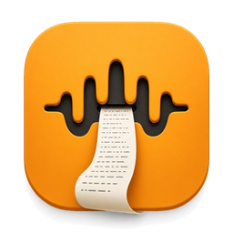
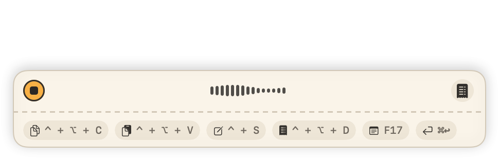

  
  <h1>Diktilo</h1>
  
Dictation for the Mac. Hold <kbd>Fn</kbd>, speak, let go. The text appears where the cursor is, in any app.

  
by <a href="https://sypian.ski/">Jakub Sypiański</a>

  
  
  

  
<a href="https://sypian.ski/diktilo/">Website</a>

  

## Download

**[Download Diktilo.dmg](https://github.com/sypianski/diktilo/releases/latest/download/Diktilo.dmg)**, one universal app for Apple Silicon and Intel Macs.

1. Open the `.dmg` and drag Diktilo into **Applications**.
2. Launch it. The app is signed and notarised by Apple.
3. Allow access to the **microphone** and to **Accessibility** (the second lets Diktilo type into other apps).
4. Accept the suggested model and wait for it to download. Then hold <kbd>Fn</kbd> and speak.

Requires macOS 14.4 Sonoma or later. Local models run best on Apple Silicon.

## Your recordings stay on your Mac

After installing, Diktilo downloads a speech recognition model to your disk. You download it once; from then on it runs on the Mac itself. **The recording never leaves the computer and dictation works without internet.**

| | Where the recording goes |
|---|---|
| **Local model** (default) | Nowhere. Speech becomes text on your own processor. |
| **API key** (only if you enter one) | To the provider you chose (Groq, OpenAI, ElevenLabs, Deepgram, Mistral, Gemini…), which sends back text. You pay the provider and need internet. |
| **Your own server** | Only to it, e.g. [speaches](https://github.com/speaches-ai/speaches) on your VPS, with live streaming over the OpenAI Realtime API. |

An API key is your ID with an outside provider: you open an account there, copy the key and paste it into Diktilo. AI enhancement of the text (punctuation, rewording) follows the same rule: locally through Ollama, or with a provider's key, in which case only the text is sent, never the recording.

## A model chosen for your Mac

On first launch Diktilo reads the chip, memory, macOS version and the languages you dictate in, and suggests a model:

| Your Mac and languages | Suggested model |
|---|---|
| Apple Silicon, English only | Parakeet V2 (V3 as an alternative) |
| Apple Silicon, European languages (Polish, German, French, Ukrainian and 21 more) | Parakeet V3: fast, light on memory, transcribes live, recognises which language you speak |
| Apple Silicon, other languages, 8 GB RAM or more | Whisper Large v3 Turbo |
| Apple Silicon, other languages, less than 8 GB | Whisper Base |
| Apple Silicon on macOS 26, one of de/en/es/fr/it/ja/ko/pt/zh | Apple Speech as an alternative, built into the system |
| Intel | a small Whisper model, with a hint that a cloud model will be faster |

You can always pick another model by hand.

## You see the text before you finish speaking

While you hold the key, a small recorder shows the waveform and the text as it is being written. **Mini** (the default) is a bar at the bottom of the screen; **Notch** slides out of the MacBook's screen notch. Below it, a strip shows the shortcuts that finish the recording and send the text somewhere specific.

If AI enhancement is on, Diktilo starts working on it while you are still speaking, so the corrected text is ready sooner when you let go.

## Where the text goes

- **Paste** at the cursor, in the app you are writing in.
- **Copy** to the clipboard; paste it yourself with <kbd>⌘V</kbd>. By default on <kbd>⌃⌥C</kbd>.
- **Edit window** with vim keys, before it goes anywhere (needs the separate Vimileto app).
- **A .md or .txt file**, e.g. appending to a daily note.
- **A shell command** (the text goes to standard input) or **a URL scheme**.

<kbd>⌘↩</kbd> finishes the recording in the current mode; <kbd>⌥1</kbd>…<kbd>⌥0</kbd> switch modes.

## Also

- Several dictation languages at once; the model recognises which one you are speaking.
- Dictionary and word replacements for names, terms and abbreviations.
- Modes: separate settings for email, notes, code and so on.
- Transcription of audio files.
- Interface in English, Polish, Esperanto and Catalan.

## Building from source

`make local` builds an unsigned app for your own use (needs Xcode); see [BUILDING.md](BUILDING.md).

## Credits

Diktilo is a fork of [VoiceInk](https://github.com/Beingpax/VoiceInk) by Pax, licensed under the GNU General Public License v3.0 (see [LICENSE](LICENSE)). It builds on [whisper.cpp](https://github.com/ggerganov/whisper.cpp), [FluidAudio](https://github.com/FluidInference/FluidAudio) (Parakeet), [KeyboardShortcuts](https://github.com/sindresorhus/KeyboardShortcuts), [LaunchAtLogin](https://github.com/sindresorhus/LaunchAtLogin), [MediaRemoteAdapter](https://github.com/ejbills/mediaremote-adapter), [Zip](https://github.com/marmelroy/Zip), [SelectedTextKit](https://github.com/tisfeng/SelectedTextKit) and [Swift Atomics](https://github.com/apple/swift-atomics).

---

Diktilo · <a href="https://sypian.ski/">Jakub Sypiański</a> · GPL-3.0

